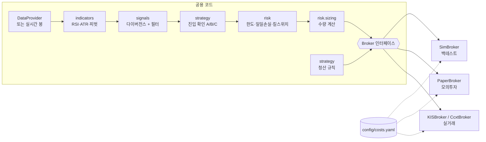

# RSI 강세 다이버전스 시스템 — 설계안 (1단계)

> 상태: **1단계 승인 대기**. 이 문서와 `config/*.yaml`이 1단계 산출물이다.
> 2단계는 데이터 확보 가능 여부 점검 보고로 시작한다.

---

## 0. 핵심 결정 요약

| 항목 | 결정 | 근거 |
|---|---|---|
| 백테스트 엔진 | **이벤트 기반 bar-by-bar 직접 구현** | 미래참조 통제, KRX 호가·원 단위 절사·펀딩비, 실거래와 코드 공유 (§5) |
| 코드 공유 방식 | 전략·사이징·리스크·비용 코드는 하나, **Broker 구현체만 교체** | SimBroker(백테스트) / PaperBroker(모의) / KISBroker·CcxtBroker(실거래) |
| 설정 | `config/*.yaml` 10개 + pydantic 스키마 검증 | 하드코딩 금지, 오타 키 거부, 파일 간 정합성 검사 |
| 자본 구조 | 자산군별 **분리 슬리브**(주식 KRW 계좌 / 코인 USDT 계좌), 성과는 일별 USD 환산 | 계좌가 물리적으로 분리되어 자본 이동 불가 |
| 시간 | 저장·계산은 UTC, 표시만 KST. 봉 시각 = 봉 **시작** 시각 | 요구사항, 타임존 버그 방지 |
| RSI 외부 비교 라이브러리 | **TA-Lib**(≥0.6, 바이너리 휠) | Wilder RSI 표준 구현. `ta` 패키지는 이 환경에서 빌드 실패 |
| 신호 탐지 | 증분형(streaming) 탐지기 하나를 모든 경로가 공유 | 백테스트=실거래 신호 일치 보장 |

---

## 1. 디렉터리 구조

```
config/                 YAML 파라미터 (전 단계 공용, §10)
docs/                   설계·단계별 보고서
src/rsidiv/
  core/                 설정 스키마·로더, 비밀정보(.env), UTC 시간 규칙, 도메인 모델
  data/                 DataProvider(KIS, ccxt), 리샘플, KOSPI200 이력, 환율, 수정주가, Parquet 캐시
  indicators/           Wilder RSI, ATR, 이동평균, 피벗 고점·저점(확정 시점 포함)
  signals/              t1→p2→t3 다이버전스 판정 + 필터
  strategy/             진입 확인(A/B/C), 손절·익절·트레일링·시간청산·장마감 청산
  backtest/             이벤트 루프, SimBroker, 비용·슬리피지·펀딩비, 성과 지표
  optimize/             Optuna/그리드, Walk-forward, 안정성 히트맵, 몬테카를로
  risk/                 사이징, 보유 한도, 일일 손실, MDD 킬 스위치, API 오류 차단
  broker/               Broker 인터페이스, PaperBroker, KISBroker, CcxtBroker
  live/                 스케줄러, SQLite 상태 복구, 주문 관리, 알림, JSON 로그
  reports/              지표 표, 차트, 거래 CSV
tests/                  단위 테스트
storage/                (gitignore) cache/ state/ logs/ reports/
```

사용자 제안 구조와 같고, 두 개를 추가했다.
- `core/`: 설정·시간·모델처럼 모든 계층이 공유하는 코드
- `strategy/`: `signals/`(패턴 판정)와 분리한 포지션 관리(진입 확인·청산 규칙)

패키지는 `src/rsidiv/` 아래에 둔다. 최상위 `data/` 같은 흔한 이름이 다른 패키지와 import 충돌하는 것을 막기 위해서다.

---

## 2. 실행 경로 (백테스트·모의·실거래 공용)



- 백테스트는 과거 봉을 한 개씩 흘려보내고, 라이브는 스케줄러가 15분봉 마감 직후 같은 함수를 호출한다.
- `costs.yaml`은 SimBroker·PaperBroker의 가상 체결 비용 계산과 실거래 비용 추정·검증에 같이 쓰인다.

---

## 3. 미래참조 방지 타이밍 규칙 (가장 중요)

```
봉 번호     t3-1   t3    t3+1  t3+2  t3+3   t3+4
                   ▲                  ▲      ▲
                   저점 후보          │      └ 진입(모드 A): 이 봉의 시가
                                      └ 이 봉의 '종가 확정 시각' = 피벗 확정 = 신호 시각
              (R=3 인 경우. t3+1~t3+R 봉의 Low 가 모두 Low(t3) 보다 높아야 함)
```

| 규칙 | 구현 위치 | 검증 테스트 (2~4단계) |
|---|---|---|
| 피벗 저점 t3는 **t3+R 봉 종가 확정 시각**에야 알 수 있다 | indicators.pivots | t3+R-1까지의 데이터로는 신호 없음 |
| 신호 시각 = close(t3+R), 진입 = 그 **다음 봉 시가** | strategy / backtest | 진입 시각 > 신호 시각 |
| t1, p2도 신호 시각까지 **확정된** 피벗만 사용한다 | signals | 데이터를 뒤에서 잘라도 과거 신호가 바뀌지 않음(prefix 불변성) |
| RSI·ATR·MA는 신호 봉까지의 값만 쓴다 | indicators | 동일 |
| 4시간봉 추세 필터는 신호 시각 **이전에 마감된** 4h 봉만 쓴다 | signals.filters | 4h 봉 경계 케이스 |
| 거래량 필터 창의 우측 길이 ≤ R | core.config 검증 | `test_volume_window_cannot_look_ahead` ✅ |
| 수량 계산 기준가 = 신호 봉 종가(다음 시가는 주문 시점에 모름) | risk.sizing | 사이징 테스트 |
| 트레일링 기준 고점은 봉 마감 후 갱신해 다음 봉부터 적용 | strategy.exits | 트레일링 테스트 |
| 같은 봉에서 손절·익절이 모두 닿으면 손절 우선. 갭으로 손절가를 건너뛰면 시가 체결 | backtest.sim_broker | 체결 모델 테스트 |

prefix 불변성 테스트는 전체 데이터로 얻은 신호 목록과, 데이터를 k번째 봉까지만 넣어 얻은 신호 목록이 신호 시각 ≤ k 구간에서 같은지 모든 k에 대해 확인한다. 미래참조를 잡는 가장 강한 테스트다.

---

## 4. 전략 정의 → 코드 매핑 (해석이 필요한 부분)

정의 자체(가격 LL, RSI HL, t1<p2<t3, High(p2) > Low(t1)·Low(t3))는 그대로 코드로 옮긴다. 아래는 요구사항이 열어 둔 부분이며, 선택지를 모두 설정값으로 두고 기본값을 정했다.

| 쟁점 | 기본값 | 대안(설정) | 이유 |
|---|---|---|---|
| 피벗의 동일가 처리 | `strict: true`: 좌우 모든 봉보다 **엄격히** 낮아야 한다 | — | 요구사항 문구("모두 낮은") 그대로. 호가단위가 큰 주식은 동일 저가가 많아 피벗 수가 줄어들 수 있다 → 2단계에서 빈도 보고 |
| t1 선택 | `previous_pivot`: t3 **직전** 피벗 저점 하나와만 비교 | `scan_window`: 간격 범위 안에서 조건을 모두 만족하는 가장 최근 피벗 | 업계 표준 방식(TradingView 등). scan은 신호가 늘지만 선택 편향이 생긴다 |
| p2 선택 | `highest_pivot`: t1~t3 사이 **피벗 고점** 중 최고가. 없으면 신호 없음 | `max_high`: 구간 최고가 봉 | 1-1절이 피벗 고점을 정의하므로 p2도 피벗으로 본다 |
| 가격 비교 기준 | `price_source: low` | `close` | 요구사항 기본값. `close`면 피벗 판별과 LL 비교를 모두 종가로 한다 |
| 세션 필터 적용 대상 | 신호 봉(t3+R) | t3 봉 / 둘 다 | "신호 제외"라는 문구 기준 |
| 장 마감 청산과 진입 | 오버나잇 미보유 시 15:00(마감 30분 전) 봉 시가에 청산하고, 그 이후 진입도 금지 | — | 청산 직전 진입 방지 |
| p2 목표가 ≤ 진입가 | `skip` | `fallback_r_multiple` | 손익비가 음수인 거래 방지 |
| 시간 청산 | 진입 봉을 1봉으로 세어 M봉째 종가 후 다음 봉 시가 청산 | — | 봉 단위 결정론 |
| 진입 B | 신호 이후 N봉 안에 `close[k] > high[k-1]`이면 k+1 시가 진입. 대기 중 손절가 이탈 시 취소 | — | 요구사항 그대로 |
| 진입 C | 신호 이후 N봉 안에 RSI가 기준값을 **아래→위로** 교차하면 다음 시가 진입 | — | 이미 기준값 위면 교차가 없으므로 진입 안 함 |

KRX 15분봉 격자: 09:00, 09:15, …, 15:15 (하루 26봉). 15:15 봉에는 종가 동시호가(15:20~15:30)가 포함된다. 기본 세션 필터는 09:00·09:15·15:00·15:15 봉에서 확정된 신호를 제외한다.

---

## 5. 백테스트 엔진: 직접 구현을 선택한 이유

| 요구사항 | vectorbt | backtrader | 직접 구현 |
|---|---|---|---|
| t3+R 확정 → 다음 시가 진입의 명시적 타이밍 | 신호 배열을 직접 shift해야 해서 실수 여지가 있다 | 가능 | 엔진이 강제한다 |
| 진입 확인 B/C(대기 상태), 트레일링, 시간청산 | 경로 의존 로직이라 numba 콜백을 써야 한다 | 가능 | 가능 |
| 자산군별 분리 자본, KRW/USDT 계좌 + 일별 USD 환산 | 어렵다 | 어렵다 | 가능 |
| KRX 호가단위 슬리피지, 수수료·세금 원 단위 절사, 매도세 일자별 스케줄 | 커스텀 필요 | 커스텀 commission 클래스 필요 | 가능 |
| 펀딩비(정산 시각 보유 판정) | 불가에 가깝다 | 커스텀 필요 | 가능 |
| 일일 손실·MDD 킬 스위치를 시뮬레이션 **도중** 적용 | 어렵다 | 가능 | 가능 |
| **실거래와 같은 코드 경로** | 불가 | 부분적(브로커 모델이 실거래와 다르다) | **가능** |
| 유지보수 | OSS판 정체, PRO판 유료 | 사실상 중단, pandas 호환 문제 | 직접 관리 |

직접 구현의 비용은 지표 계산과 성능이다.
- 지표·피벗은 종목별로 numpy 벡터 연산으로 미리 계산하고, 확정 시각을 명시적으로 붙인다.
- 이벤트 루프는 주문·포지션·리스크만 처리한다.
- 추정 규모: KOSPI200 × 26봉 × 약 430거래일 ≈ 230만 봉.

단일 백테스트는 수십 초 안에 끝날 것으로 추정한다. 5단계 최적화 속도가 부족하면 신호 생성만 벡터화 경로로 바꾸고, 증분형과 결과가 같은지 테스트로 보장한다.

### 봉 하나의 처리 순서 (타임스탬프 T)
1. **T 시가**: 대기 중인 시장가 주문(진입, 시간청산, 세션청산, 킬 스위치 청산)을 체결한다. 슬리피지를 적용한다.
2. **봉 내부**: 보유 포지션의 손절(스탑) → 익절(지정가) 순으로 판정한다. 둘 다 닿으면 손절이다. 진입 봉에도 적용한다.
3. **펀딩 정산**(선물): 정산 시각 S가 (진입 시각, 청산 시각] 안에 있으면 반영한다.
4. **T 종가**: 지표·피벗 갱신 → 신호 → 필터 → 진입 확인 → 리스크 게이트 → 사이징 → 다음 봉 시가 주문을 등록한다. 보유 봉 수와 트레일링을 갱신한다.
5. **평가**: 평가금액을 기록하고 일일 손실·MDD를 판정한다. 판정 결과는 다음 봉부터 적용된다.

---

## 6. 비용 모델 (`config/costs.yaml` 하나를 백테스트·모의·실거래가 공유)

| 구분 | 매수 | 매도 | 비고 |
|---|---|---|---|
| KIS 국내주식 수수료 | 0.0140527% | 0.0140527% | 유관기관제비용 포함, 원 미만 절사. Open API 적용 요율은 계좌 확인 필요 |
| 증권거래세+농특세(코스피) | — | 0.20% | 원 미만 절사. **일자별 스케줄 지원**(아래 §11 참고) |
| 국내주식 슬리피지 | +1호가 | −1호가 | 시장가·스탑시장가만. 지정가 익절은 0 |
| 바이낸스 현물 | 0.10% | 0.10% | BNB 결제 시 25% 할인(옵션) |
| 바이낸스 USDⓈ-M 선물 | 메이커 0.02% / 테이커 0.05% | | 명목가치 기준, BNB 10% 할인(옵션), 펀딩비 이력 반영 |
| 코인 슬리피지 | 테이커 0.02% | | 메이커 0 |

주문 유형별 체결 구분: 시장가·스탑시장가(손절·트레일링) = 테이커, 호가창 대기 지정가(익절) = 메이커.

비교 시나리오:
- 슬리피지 ×0 / ×1 / ×2
- 비용 반영 전(gross) / 후(net)

---

## 7. 포지션 사이징

```
위험금액   = risk_per_trade(1%) × 자산군 슬리브 평가금액
1R(주당)  = (기준가 − 손절가) + 예상 비용·슬리피지            ← include_costs_in_risk
수량      = floor_to_lot(위험금액 / 1R)
상한      = min(max_weight × 슬리브 평가금액, 가용현금) / 기준가
수량      = min(수량, 상한)                                   ← on_cap_exceeded: cap
수량 < 최소단위 또는 명목가 < 최소주문금액 → "자본 부족 스킵" 기록
```

**소액 자본 경고** (기본값 기준, 비용 제외 단순 계산):
- 주식 슬리브 $500 ≈ 73만 원(환율 약 1,470 가정). 거래당 위험금액은 약 7,300원이다.
- 60,000원 종목을 손절폭 1.5%로 사면 위험 기준 8주(48만 원, 65%)가 나온다. 비중 상한 34%에 걸려 4주로 줄고, 실제 위험은 약 0.5%가 된다.
- **약 25만 원 이상인 종목은 1주도 살 수 없다**(34% 상한). 그래서 KOSPI200 고가주 신호는 대부분 "자본 부족 스킵"이 된다.
- 코인 슬리브 500 USDT: BTC 손절폭 0.8%면 위험 기준 명목가는 625 USDT(125%)다. 현물은 레버리지가 없고 비중 상한이 50%라서 실제 위험은 약 0.4%가 된다.

→ 결론: 이 자본 규모에서는 **1% 리스크가 아니라 비중 상한이 실제 포지션 크기를 결정한다.** 4단계 리포트에 스킵 수와 상한 적용 비율을 따로 집계한다.

---

## 8. 리스크 관리 (실거래 규칙이며, 백테스트에서는 켜고 끈 두 버전을 비교)

| 이벤트 | 판정 기준 | 발동 시 | 리셋·해제 |
|---|---|---|---|
| 일일 손실 3% | 계좌별. (당일 시작 평가금액 − 현재 평가금액) / 당일 시작 평가금액 ≥ 3%. 실현+미실현 포함 | 해당 계좌 당일 신규 진입 중단. 기존 손절·익절 유지 | 코인: 매일 00:00 KST, 주식: 장 시작 시점. **자동 리셋** |
| 누적 MDD 30% | 운용 시작 이후 평가금액 최고점 대비 하락률. 기본은 **합산 USD** | 전체 신규 진입 차단. 보유분은 `flatten_all` 또는 `keep_stops` 중 설정대로 처리 | **자동 재개 금지**. 발동 시 발급된 `trip_id`를 `risk.yaml`의 `kill_switch.release_ack`에 입력해야 해제 |
| API 연속 오류 5회 | 계좌별 연속 실패 수. 성공 1회면 0으로 초기화 | 거래 중단 → 미체결 주문 조회·기록 → 알림 | 수동 해제 (`api_errors.release_ack`) |

- 해제에 `true`/`false` 대신 **발동 ID**를 요구하는 이유가 있다. 예전 해제값이 설정에 남아 있어도 다음 발동이 자동으로 풀리지 않게 하려는 것이다.
- 세 이벤트 모두 발생 시각, 계좌 상태(평가금액·현금·포지션), 트리거 값(임계값, 실측값)을 JSON 로그와 알림에 남긴다.
- 상태(카운터, 최고점, 발동 여부)는 SQLite에 저장하므로 재시작해도 이어진다.

---

## 9. 데이터 계층

| 데이터 | 소스(기본) | 비고 |
|---|---|---|
| 국내주식 분봉 | KIS Open API 1분봉 → 15분봉 리샘플 | KRX 시세만 사용(`market_division: J`). **과거 분봉 보관기간 제약이 알려져 있음** → 2단계 실측 |
| 가상화폐 15분봉 | ccxt/바이낸스 (대량 구간은 data.binance.vision 월별 파일) | 2017년부터 존재 |
| 펀딩비 | 바이낸스 fapi 펀딩 이력 | 선물 선택 시에만 사용 |
| KOSPI200 구성종목 이력 | KRX 정보데이터시스템 | 정기변경(6·12월)과 수시변경(상폐·합병) 반영 |
| 수정주가 | KIS 일봉 수정주가 ÷ 원주가 비율을 날짜별로 분봉에 적용 | 액면분할·병합 보정. 배당락은 보정하지 않음(설정) |
| USD/KRW | FRED DEXKOUS (대안: 한국은행 ECOS, yfinance) | 휴일 결측은 직전 값 사용. 성과 환산 전용이며 신호에는 쓰지 않음 |
| 캐시 | `storage/cache/{provider}/{symbol}/{YYYY-MM}.parquet` | 최근 N일 파티션만 재다운로드 |

결측 처리:
- 장중 무체결 봉은 직전 종가로 채운 flat 봉으로 만든다(거래량 0).
- 거래정지일은 봉을 만들지 않는다. 연속 결측이 임계값을 넘으면 경고한다.

생존편향: 상장폐지·편출 종목은 편입 기간 동안 유니버스에 포함한다. 분봉을 구할 수 없는 종목은 **리포트에 목록과 개수를 명시**한다.

---

## 10. 설정 파일

| 파일 | 내용 |
|---|---|
| `base.yaml` | 기준통화 USD, 초기자본 1,000, 배분 50/50, 저장 경로 |
| `universe.yaml` | KOSPI200(시점별 편입, 상폐 포함 여부), BTC/USDT·ETH/USDT, 현물/선물 선택 |
| `data.yaml` | 15분봉, 백테스트 기간, KIS/ccxt 설정, 환율, 결측·수정주가, 캐시 |
| `markets.yaml` | KRX 거래시간·동시호가·호가단위표, 바이낸스 최소 주문단위(대체값) |
| `strategy.yaml` | 피벗·RSI·다이버전스·필터·진입·청산 (default + 자산군별 override) |
| `costs.yaml` | 수수료·세금·슬리피지·펀딩비, 주문유형별 메이커/테이커, 민감도 시나리오 |
| `risk.yaml` | 사이징, 보유 한도, 일일 손실, 킬 스위치, API 오류 |
| `backtest.yaml` | 체결 규칙, 리스크 규칙 on/off 비교, 벤치마크, 산출물 |
| `optimize.yaml` | 탐색 공간, Walk-forward(12M/6M), 안정성, 몬테카를로 1000회 |
| `live.yaml` | paper/live 모드, 스케줄러, 주문 처리, 알림, 로그 |

검증 규칙(로드 시 오류):
- 미정의 키(오타)
- 배분 합계가 1이 아님
- 거래량 창이 R을 넘음(미래참조)
- `auto_resume: true`
- `live_confirm` 없이 `mode: live`
- 따옴표 없는 시각(YAML이 `15:30`을 정수 930으로 읽음)
- 상위 TF가 15분의 배수가 아님
- 최적화 탐색 키·값을 전략 파라미터에 적용할 수 없음
- 코인 심볼의 거래소 필터 누락

실험용 덮어쓰기는 `python -m rsidiv config --override my_experiment.yaml`로 한다.

### 요구사항에서 비어 있던 값에 넣은 기본값 (승인 필요)

| 항목 | 기본값 |
|---|---|
| 동시 보유 종목 수 / 종목당 최대 비중 | 주식 3종목·34% / 코인 2종목·50% |
| 시간 청산 M | 32봉(8시간) |
| 손절 | ATR(14) × 1.0 (대안 pct 0.5%) |
| 익절 | 2R (대안 p2 / 트레일링 ATR×3) |
| 진입 방식 | A (B·C의 N=3, C 기준값 RSI 30) |
| 추세·거래량 필터 | 기본 off. 켜면 4h EMA50 위 / t3 거래량 ≥ 20봉 평균 × 1.2 |
| 코인 시장 | 현물(spot) |
| 킬 스위치 범위·처리 | 합산 USD 기준, `keep_stops` |
| API 오류 중단 해제 | 수동 |
| 최적화 목표 | 기대값(R), 최소 거래 30건 |

---

## 11. 가정·리스크·확인 필요 사항

1. **KIS 과거 분봉 보관기간.** KIS의 과거 분봉 조회는 서버 보관분(공개 문서상 최대 약 1년)만 제공하는 것으로 알려져 있다. 그렇다면 주식은 2025-01-01부터 확보할 수 없을 가능성이 높고, **1년 학습 + 6개월 검증 Walk-forward를 주식에 적용하기 어렵다.** 2단계에서 실측하고 대안(기간 단축, 수집 누적, 유료 데이터)을 보고한다.
2. **KIS API 키 필요.** 주식 데이터 점검과 수집에는 사용자의 KIS 앱키가 필요하다. `.env`로만 전달하며 코드·로그에 남기지 않는다. 이 원격 환경에서 키 없이 할 수 없는 점검은 스크립트로 제공해 로컬에서 실행하는 방식도 가능하다.
3. **바이낸스 접근.** api.binance.com은 일부 지역(예: 미국 IP)에서 차단된다. 2단계에서 이 환경의 접근 가능 여부를 확인하고, 막히면 data.binance.vision 파일을 사용한다. 국내 거주자의 해외 거래소 이용과 관련된 규제·계정 요건은 사용자가 확인할 사항이다.
4. **매도세율.** 사용자 지정 0.20%를 전 기간에 적용했다. 2025년 실제 코스피 매도세율은 0.15%(거래세 0% + 농특세 0.15%)이고 2026년부터 0.20%다. 과거 실제 세율 스케줄로 바꾸는 방법은 `costs.yaml` 주석에 있다(보수적인 쪽은 현재 설정).
5. **USDT = USD 1:1** 로 가정했다(`fx.usdt_per_usd`).
6. **환율 시점.** FRED DEXKOUS는 뉴욕 정오 기준이라 KST 당일 종가보다 늦게 확정된다. 이 값은 성과 환산에만 쓰므로 신호에 미래참조는 없지만, 일별 USD 수익률에 약간의 시점 불일치가 있다.
7. **KIS 국내주식 손절 주문.** Open API에 서버측 스탑 주문이 없는 것으로 가정했다. 그래서 실거래 손절은 실시간 시세 감시 후 시장가로 낸다(`client_monitor`). 이 경우 프로세스가 다운된 동안에는 손절이 작동하지 않는다. 7단계에서 KIS 조건부 주문 지원 여부를 재확인한다.
8. **소액 자본.** §7대로 비중 상한이 지배하고 고가주는 거래할 수 없다. 전략 자체의 우위와 자본 제약 효과가 섞여 보이지 않도록, 4단계에서는 "무제약(분할 수량 허용) 참고 결과"도 함께 보고할 것을 제안한다.
9. **데이터 기간 대비 검증 폴드 수.** 약 21개월 데이터로 12M/6M 롤링을 하면 검증 구간이 1.5개 정도밖에 나오지 않는다. 통계적 신뢰도가 낮으므로 5단계에서 폴드 수와 신뢰구간을 함께 보고한다.
10. **배당락.** 수정주가에는 배당락이 반영되지 않는다. 배당락일 시가 갭이 가짜 저점(t3)을 만들 수 있으므로 3단계 육안 검증에서 확인한다.

---

## 12. 단계별 산출물·승인 체크리스트

| 단계 | 산출물 | 승인 기준 |
|---|---|---|
| 1 | 구조, 설정 파일, 설정 검증 코드·테스트, 이 문서 | 구조·기본값·해석 선택 승인 |
| 2 | 데이터 확보 점검 보고 → Provider·캐시·리샘플·유니버스·환율, RSI, 피벗, 테스트 | 자산별 확보 기간 확정, RSI가 TA-Lib과 일치, 피벗 미래참조 테스트 통과 |
| 3 | 다이버전스 신호, 신호 차트(BTC/USDT 최근 3개월) | 육안 검증에서 정의와 일치 |
| 4 | 엔진, 비용, 리포트, 거래 CSV | 비용 전/후, 자산군별, 리스크 규칙 on/off 비교 |
| 5 | 최적화, Walk-forward, 히트맵, 몬테카를로 | IS/OOS 분리 보고와 "부적합 근거" 포함 |
| 6 | PaperBroker, 운영 스크립트 | 4주 이상 운영 후 괴리 분석 |
| 7 | KISBroker, CcxtBroker, 스케줄러, 리스크, 알림 | 리스크 발동·리셋 테스트 통과 |
