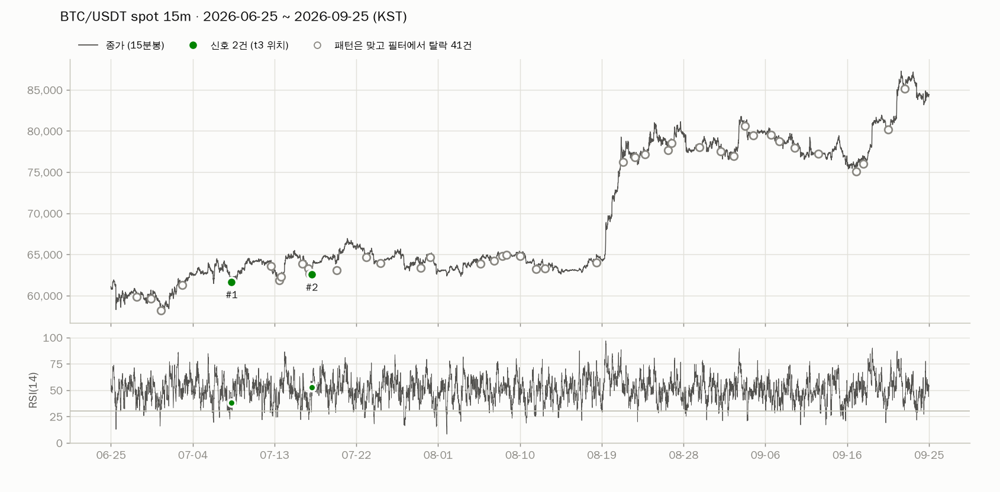
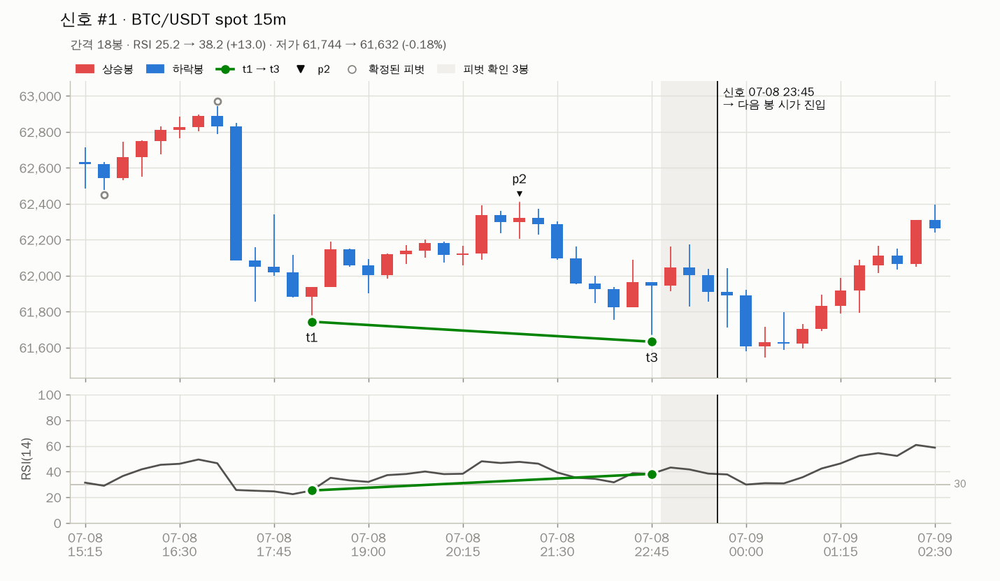
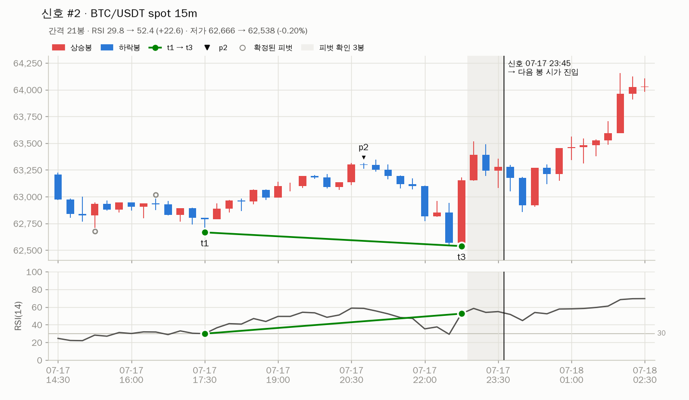
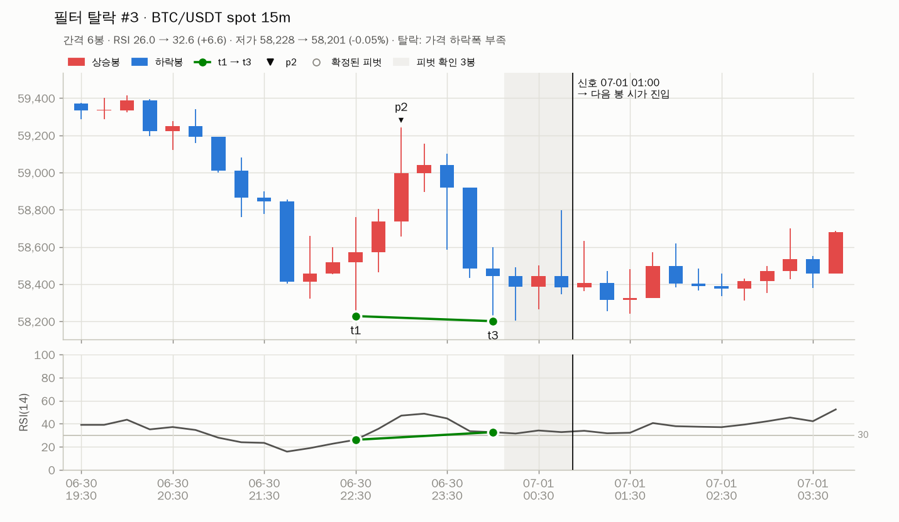
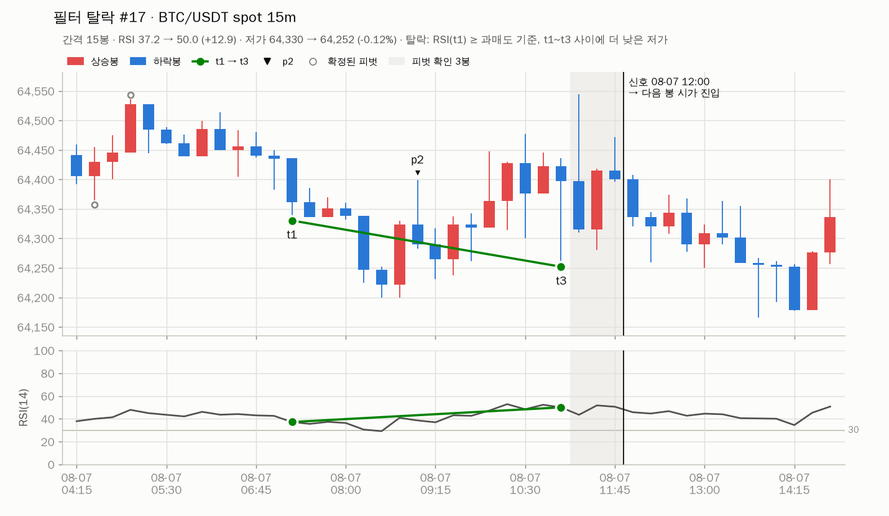

# 3단계 보고: 다이버전스 신호와 육안 검증

> 작성일: 2026-09-25 (UTC). 대상: 바이낸스 현물 BTC/USDT(요청 범위), 참고로 ETH/USDT. 15분봉, 기본 파라미터.
> 재현: `python -m rsidiv signals` (ETH: `--symbol ETH/USDT`) → `storage/reports/signals/<심볼>_<시장>_<기간>/`
> (`summary.md`, `overview.png`, 신호별·탈락 후보별 차트, `candidates.csv`).
> 이 문서의 그림은 `docs/stage3/`에 복사한 일부다.

## 1. 결론

| 항목 | 결과 |
|---|---|
| 탐지기 | 증분형 `DivergenceDetector` 하나. 백테스트도 봉을 한 개씩 넣어 같은 코드를 쓴다. 60,672봉 처리 약 0.6초 |
| 정확성 | 독립 참조 구현(일괄 계산 + 단순 반복)과 모든 t3 후보의 판정(t1·p2·실패 사유)이 일치. 파라미터 조합 10가지 × 데이터 2종, 국내주식 세션 필터 3종 |
| 미래참조 | 신호 봉 = t3 + R, 신호 시각 = 그 봉 종가 확정 시각. prefix 불변성(모든 k), 미래 봉 변경 불변성, 4h 추세 필터가 마감된 4h 봉만 쓰는지 테스트 통과 |
| BTC/USDT 최근 3개월 (2026-06-25 ~ 09-25 KST) | **신호 2건**, 패턴은 맞지만 필터에서 탈락한 후보 41건. 육안 검증에서 두 신호 모두 정의와 일치 |
| 전체 기간 (2025-01-01 ~ 2026-09-24) | BTC 57건, ETH 59건 (월 평균 약 2.7건). BTC는 8~9월 급등 구간에 신호 없음 |

## 2. BTC/USDT 최근 3개월

초록 원이 신호(t3 위치), 회색 빈 원이 "정의는 만족하지만 필터에서 탈락"한 후보다. 8월 중순 이후 강한 상승장에서는
RSI(t1) < 30을 만족하는 저점이 드물어 신호가 없다.

### 신호

| # | 신호 시각 (KST) | t1 | p2 | t3 | 간격 | RSI t1 → t3 | 저가 t1 → t3 |
|---|---|---|---|---|---:|---|---|
| 1 | 2026-07-08 23:45 | 07-08 18:15 | 07-08 21:00 | 07-08 22:45 | 18봉 | 25.2 → 38.2 | 61,743.83 → 61,632.23 (−0.18%) |
| 2 | 2026-07-17 23:45 | 07-17 17:30 | 07-17 20:45 | 07-17 22:45 | 21봉 | 29.8 → 52.4 | 62,666.00 → 62,537.56 (−0.20%) |

육안 검증 항목 (두 신호 공통):
- t3 저가 < t1 저가, RSI(t3) > RSI(t1), RSI(t1) < 30 ✅
- p2는 t1~t3 사이 피벗 고점 중 최고가이고, 두 저점보다 높다 ✅
- t1은 t3 직전 피벗 저점이다(사이에 다른 피벗 저점 없음). t1~t3 사이 봉의 저가가 모두 t3 이상이다 ✅
- t3 오른쪽 3봉(회색 띠)의 저가가 모두 t3보다 높고, 신호 시각은 띠 끝(= t3+3 봉 종가 확정)이다. 진입은 그다음 봉 시가 ✅

### 판정 퍼널 (확정된 피벗 저점마다 한 번 판정, 첫 번째 탈락 사유로 집계)

| 첫 번째 탈락 사유 | BTC 3개월 | BTC 전체 | ETH 전체 |
|---|---:|---:|---:|
| t1 후보 없음 / RSI 워밍업 (데이터 시작점) | 0 | 2 | 2 |
| t1~t3 사이 p2(피벗 고점) 없음 | 159 | 1,175 | 1,292 |
| 가격 저점이 낮아지지 않음 | 307 | 1,956 | 2,047 |
| RSI 저점이 높아지지 않음 | 149 | 1,036 | 1,054 |
| High(p2)가 두 저점보다 높지 않음 | 0 | 1 | 0 |
| t1~t3 간격 5~60봉 밖 | 1 | 7 | 7 |
| RSI(t1) ≥ 30 | 36 | 250 | 185 |
| RSI 상승폭 < 2 | 2 | 3 | 7 |
| 가격 하락폭 < 0.1% | 2 | 19 | 6 |
| **신호** | **2** | **57** | **59** |
| 합계 (t3 후보) | 658 | 4,506 | 4,659 |

- 정의 자체(가격 LL + RSI HL + p2 구조)를 만족하는 후보는 BTC 전체 기간 336건, 그중 필터를 모두 통과한 신호가 57건이다.
  사실상 **RSI(t1) < 30 필터가 신호 수를 결정**한다.
- 퍼널은 첫 번째 사유만 센다. 한 후보가 여러 필터에 걸리는 경우는 `candidates.csv`의 `failed` 열에 모두 있다.

전체 기간 신호의 중앙값 (BTC / ETH): 간격 15 / 16봉, RSI(t1) 24.1 / 24.1, RSI 상승폭 10.4 / 7.8, 가격 하락폭 0.32% / 0.53%.

### 필터 탈락 예

가격 하락폭 0.05% < 0.1%로 탈락. 필터가 없었다면 "거의 같은 저점"이 신호가 됐을 것이다.

**육안 검증에서 확인한 점**: 08:15와 08:30 봉의 저가가 64,200.00으로 **같다**. `strict: true`에서는 좌우 모든 봉보다
엄격히 낮아야 피벗이므로 이 쌍바닥은 피벗이 아니다. 그래서 t1이 그 앞의 07:15 저점으로 잡혔고, t1~t3 사이에 t3보다 낮은
저가가 있어 `no_lower_low_between` 필터가 후보를 걸렀다. 필터가 의도대로 동작한 사례지만, 사람 눈에는 명백한 스윙 저점이
동일가 때문에 피벗에서 빠진다는 점은 기억해 둘 만하다. BTC는 64,200 같은 라운드 넘버에서 동일 저가가 나온다.
(2단계 통계로는 `strict: false`로 바꿔도 피벗 저점 수가 1.9%만 늘어난다. 5단계 최적화에서 비교 대상으로 둘 수 있다.)

## 3. 구현

| 모듈 | 내용 |
|---|---|
| `signals/divergence.py` | `DivergenceDetector`(증분), `detect_divergences`(프레임 → 후보 목록), `candidates_frame`. 후보마다 t1·p2·t3·신호 시각·가격·RSI·실패 사유 전부를 기록 |
| `indicators/ma.py` | `SmaState`·`EmaState` (증분 이평, 일괄과 비트 단위 일치. SMA는 `math.fsum`) |
| `data/resample.py` | `BarAggregator` (증분 리샘플, 추세 필터의 4h 봉) |
| `reports/signal_charts.py`·`signal_report.py` | 개요·확대 차트(PNG), 후보 CSV, 요약 Markdown |
| `python -m rsidiv signals` | 위 보고서 생성. `--symbol`, `--market`, `--months`(기본 3), `--end` |

해석 규칙 (설계 §4에 추가, 모두 코드 docstring과 테스트에 반영):

| 쟁점 | 구현 |
|---|---|
| t1·p2가 신호 시각까지 확정된 피벗인가 | 피벗 i의 확정 봉은 i+R이고 t1·p2 < t3이므로 판정 시점(t3+R)에 항상 확정되어 있다 |
| `scan_window`의 탐색 범위 | `gap_bars`의 min~max (`gap_bars.enabled`와 무관). 가까운 후보부터 보고, 모두 실패하면 가장 가까운 후보의 사유를 기록 |
| p2 동률 | 같은 최고가면 앞선 봉 |
| `no_lower_low_between` | t1과 t3 사이 **모든 봉**의 저가(가격 기준)가 Low(t3) 이상. 피벗만 보면 `previous_pivot`에서는 항상 통과하는 무의미한 필터가 된다 |
| 추세 필터의 `close` | 신호 봉 종가. `htf_ma`는 신호 봉 종가 시각까지 **마감된** 상위 봉 종가로 이평을 계산. 이평이 아직 없으면 탈락 |
| 거래량 필터 | 창 = [t3 − bars_before + 1, t3 + bars_after]. 기준 구간이 데이터 시작 이전이면 탈락, 기준 거래량 0이면 현재 창 거래량 > 0일 때만 통과 |
| RSI 워밍업 | RSI(t1) 또는 RSI(t3)가 아직 없으면 탈락 (`rsi_warmup`) |

## 4. 테스트 (`tests/test_divergence.py`, `tests/test_signal_report.py`)

- **참조 구현 일치**: 일괄 피벗·RSI·이평·리샘플과 단순 반복문으로 짠 별도 구현과 모든 후보의 (t3, 신호 봉, t1, p2, 실패 사유)가 같다.
  기본값, 완화 필터, `scan_window`, `max_high`, `price_source: close`, `strict: false`, 15분봉 이평 추세, 1h 이평 추세,
  거래량 2종 = 10가지 × 난수 데이터 2종(연속가, 호가단위 반올림). 필터가 켜진 조합은 통과·탈락 두 경우가 모두 나오는지도 확인한다.
- **국내주식 세션 필터**: KRX 격자(09:00~15:15 KST) 데이터에서 `signal_bar`·`t3_bar`·`both` 모두 참조 구현과 일치. 코인에는 적용되지 않는다.
- **미래참조**: 신호 봉 = t3 + R·신호 시각 = 종가 확정 시각, prefix 불변성(모든 k), 미래 봉을 무작위로 바꿔도 과거 판정 불변,
  4h 추세 이평 = 그 시각까지 마감된 4h 봉으로 일괄 계산한 값.
- **손으로 만든 예**: 교과서형 다이버전스 1건 검출, 가격 조건·과매도 필터·사이 저가 필터 실패, 설정 오류.
- **증분 계산**: `SmaState`·`EmaState` = 일괄 (비트 단위), `BarAggregator` = `resample_ohlcv` (결측 봉·장 마감 포함).

## 5. 3단계 승인 기준

| 기준 | 상태 |
|---|---|
| 다이버전스 신호 구현 | ✅ |
| BTC/USDT 최근 3개월 신호 차트 | ✅ 신호 2건 + 필터 탈락 41건 차트 |
| 육안 검증에서 정의와 일치 | ✅ 신호 2건·탈락 예시 차트 검토 완료. 사용자 확인 대기 |

## 6. 확인이 필요한 사항

1. **신호 빈도가 낮다.** 기본 필터에서 BTC 3개월 2건, 전체 21개월 57건이다. Walk-forward 학습 구간(12개월)에 코인 두 종목을
   합쳐 신호가 약 65건이고, 동시 보유 한도·자본 부족 스킵 때문에 실제 거래는 이보다 적다. 지금은 기본값을 그대로 두고,
   필터 완화는 5단계 최적화에서 IS/OOS로 판단하는 것을 제안한다.
2. **동일가 쌍바닥** (2절 near #17): `strict: true` 유지를 제안한다. 요구사항 문구("모두 낮은") 그대로이고, 문제가 되는 경우는
   `no_lower_low_between` 필터가 막는다.
3. **4단계(백테스트 엔진 + 성과 리포트) 진행 여부.**
