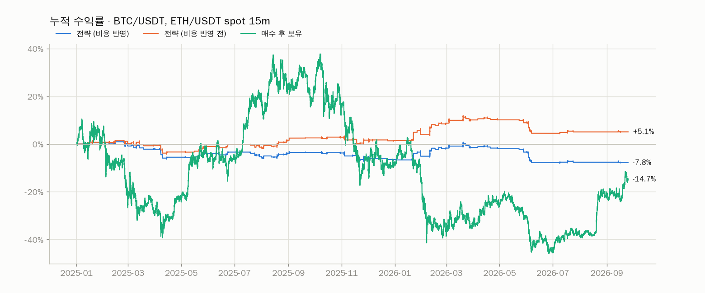
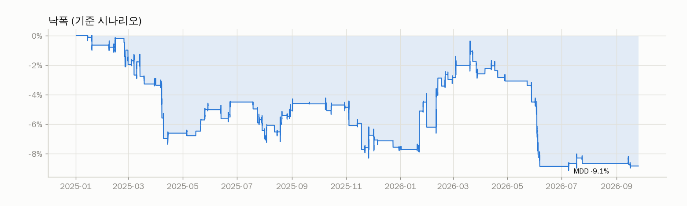
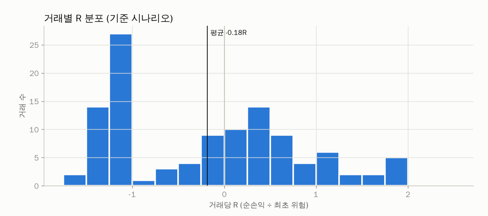
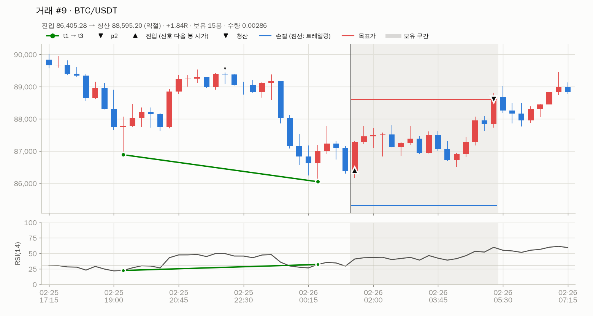
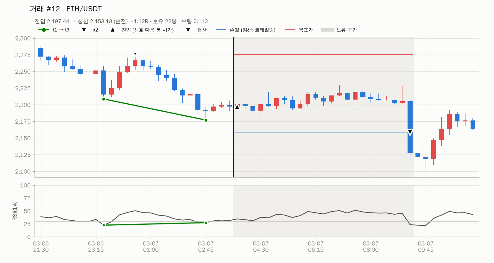
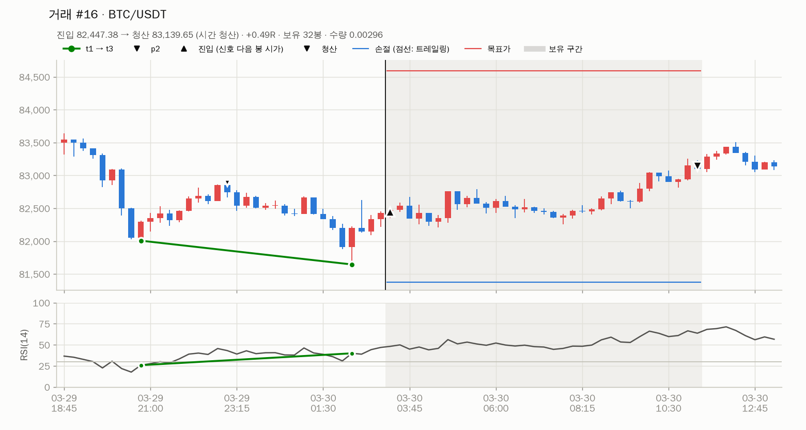

# 4단계 보고: 백테스트 엔진과 성과 리포트

> 작성일: 2026-09-25 (UTC). 대상: 바이낸스 현물 BTC/USDT·ETH/USDT 15분봉, 2025-01-01 ~ 2026-09-24,
> 코인 슬리브 500 USDT(초기자본 1,000 USD × 50%). 국내주식 슬리브는 데이터 보류로 제외했다.
> 재현: `python -m rsidiv backtest` → `storage/reports/backtest/spot_20250101_20260924/`
> (`summary.md`, `trades.csv`, `signals.csv`, `equity.csv`, 차트, 거래 표본 30건).

## 1. 결론

| 항목 | 결과 |
|---|---|
| 엔진 | 이벤트 기반 bar-by-bar. 전략·사이징·리스크·비용 코드는 모의·실거래와 공용(`AccountController`), 체결만 `SimBroker` |
| 검증 | 회계 항등식(최종 평가금액 = 초기자본 + Σ거래 순손익, 오차 1e-12), 체결 규칙 11종, 통합 시나리오 17종, 미래참조(데이터를 잘라도 이전 거래 불변) |
| **기본 파라미터 성과** | **비용 반영 −7.8%** (MDD 9.1%, 112거래, 기대값 −0.18R). 비용 반영 전 +5.1% (+0.04R) |
| 원인 | 비용이 거래당 약 0.22R. 손절폭 중앙값이 가격의 1.3%라 왕복 수수료 0.2%가 0.15R을 넘는다. 비용 전 우위(+0.04R)가 이를 감당하지 못한다 |
| 매수 후 보유 | −14.7% (MDD 60.8%). 전략은 시간의 3.9%만 포지션을 보유해 낙폭이 작다 |
| 리스크 규칙 | 일일 손실 3%·누적 MDD 30%에 한 번도 닿지 않아 켠 결과와 끈 결과가 같다 |

기본값으로는 수익이 나지 않는다. 필터·청산 파라미터를 바꿔 개선할 여지가 있는지는 5단계에서 학습/검증 구간을 나눠 판단한다.

## 2. 시나리오 비교 (현물, 기본 파라미터)

| 시나리오 | 총수익률 | CAGR | MDD | 샤프 | 거래 | 승률 | 기대값(R) | PF | 수수료 |
|---|---:|---:|---:|---:|---:|---:|---:|---:|---:|
| **기준** (비용·슬리피지 ×1·리스크 규칙) | **−7.8%** | −4.6% | 9.1% | −0.75 | 112 | 46% | −0.182 | 0.76 | 48.97 |
| 비용 반영 전 | +5.1% | +2.9% | 6.9% | 0.50 | 112 | 51% | +0.038 | 1.18 | 0 |
| 슬리피지 ×0 | −5.5% | −3.2% | 8.5% | −0.51 | 112 | 48% | −0.144 | 0.82 | 49.76 |
| 슬리피지 ×2 | −9.4% | −5.5% | 10.6% | −0.91 | 112 | 46% | −0.205 | 0.71 | 48.38 |
| 리스크 규칙 미적용 | −7.8% | −4.6% | 9.1% | −0.75 | 112 | 46% | −0.182 | 0.76 | 48.97 |
| 매수 후 보유 (BTC·ETH 균등) | −14.7% | −8.8% | 60.8% | 0.06 | – | – | – | – | – |

참고 (같은 신호, 비용 구조만 다름):

| 변형 | 비용 반영 | 비용 반영 전 | 기대값(R) | 수수료 |
|---|---:|---:|---:|---:|
| 현물 + BNB 수수료 25% 할인 | −5.4% | +5.1% | −0.138 | 37.35 |
| USDⓈ-M 선물 (메이커 0.02%·테이커 0.05%, 펀딩비) | −8.0% | −1.7% | −0.159 | 21.94 (+펀딩 0.25) |

선물은 수수료가 절반 이하지만 선물 봉으로 잡힌 신호의 비용 전 성과가 −0.04R이라 결과가 비슷하다. 수수료를 줄이는 것만으로는 부족하다.

## 3. 기준 시나리오 상세

| 항목 | 값 |
|---|---:|
| 신호 → 진입 | 116 → 112 (4건은 같은 종목 보유 중) |
| 승률 / 기대값 | 46.4% / −0.182R (중앙값 −0.087R) |
| 평균 이익 / 손실 | +0.72R / −0.96R |
| 평균 보유 | 23.3봉 (약 6시간) |
| 최대 연속 손실 | 13회 |
| 평균 MAE / MFE | 0.62R / 0.84R. **MFE ≥ 2R 인 거래는 7%**, ≥ 1R 은 36% |
| 비중 상한에 걸린 진입 | 79건 (71%). 실제 거래당 위험 중앙값 0.63% (목표 1%) |
| 손절폭 (진입가 대비) | 중앙값 1.32%, 평균 1.60% |
| 비용 | 수수료 48.97 USDT = 거래당 평균 0.18R, 슬리피지 약 0.04R |

| 청산 사유 | 건수 | 평균 R |
|---|---:|---:|
| 시간 청산 (32봉) | 61 | +0.30 |
| 손절 | 43 | −1.23 |
| 익절 (2R) | 8 | +1.75 |

| 종목 | 거래 | 승률 | 기대값(R) | 수수료 전 R | 순손익 |
|---|---:|---:|---:|---:|---:|
| BTC/USDT | 55 | 47% | −0.216 | +0.003 | −14.19 |
| ETH/USDT | 57 | 46% | −0.150 | −0.013 | −24.64 |

| 연도 | 기준 | 비용 반영 전 |
|---|---:|---:|
| 2025 | −6.5% | +1.5% |
| 2026 (9/24까지) | −1.4% | +3.6% |

해석:
- **2R 목표가 8시간 안에 거의 닿지 않는다.** 대부분 시간 청산(평균 +0.30R)이다. 목표 R, 시간 청산 봉 수, 손절 ATR 배수가
  서로 맞물려 있어 5단계 탐색 공간(`exit.stop.atr_mult`, `exit.take_profit.r_multiple`, `exit.time_exit.max_bars`)의 핵심이다.
- **손절이 평균 −1.23R** 인 것은 비용(수수료·슬리피지) 때문이다. 손절가를 건너뛴 갭은 드물다(코인은 연속 거래).
- 설계 §7의 예상대로 **1% 위험보다 비중 상한 50%가 수량을 결정**한다(71%). 소액 자본에서 손절폭이 좁으면 생기는 현상이다.

### 거래 표본 (육안 확인)

익절, 손절, 시간 청산 사례. 30건 표본은 `trades/` 폴더에 있다.

확인 항목: 진입 = 신호 봉 다음 봉 시가(검은 세로선 = 신호 시각), 손절 = Low(t3) − ATR(신호 봉), 목표 = 진입가 + 2R,
손절은 스탑 가격(갭이면 시가)에 테이커 슬리피지, 익절은 목표가에 메이커(슬리피지 0), 시간 청산은 32봉째 종가 후 다음 봉 시가.

## 4. 구현

| 모듈 | 내용 |
|---|---|
| `broker/costs.py` | 비용 모델: 코인 메이커/테이커·BNB 할인·슬리피지 %·펀딩비, 국내주식 수수료·매도세(일자별, 원 절사)·호가 슬리피지. 시나리오 배수·비용 제외 모드 |
| `broker/instruments.py` | 수량 단위·호가 반올림 (Decimal), 최소 수량·금액 |
| `broker/sim.py` | `SimBroker` (Broker 인터페이스 구현): 시가 시장가, 스탑(갭 시 시가), 지정가 touch/through, 손절 우선, OCO, 봉 중간 주문 보수 판정, 펀딩 정산 |
| `strategy/rules.py` | 손절(ATR/%), 익절(R/p2/트레일링/없음), 진입 확인 A/B/C |
| `strategy/controller.py` | `AccountController`: 신호 → 진입 확인 → 리스크 게이트 → 사이징 → 주문, 보유 관리(시간 청산·트레일링·장 마감 청산), 신호별 결과와 거래 기록(R, MAE/MFE) |
| `risk/sizing.py` | 1% 위험, 1R에 비용 포함, 비중·현금 상한, 최소 주문 미만 스킵 |
| `risk/manager.py` | 일일 손실 한도(코인 00:00 KST·주식 장 시작 리셋), 킬 스위치(발동 ID로만 해제) |
| `backtest/engine.py` | 이벤트 루프, 시나리오 |
| `backtest/metrics.py` | CAGR, MDD(기간 포함), 샤프·소르티노(일별 KST, 365일), 칼마, 거래 지표, 매수 후 보유 |
| `reports/backtest_*.py` | CSV, 차트, 요약 |
| `python -m rsidiv backtest` | `--market`, `--start/--end`, `--override`, `--scenarios all\|base`, `--no-charts` |

체결 규칙 중 새로 정한 것 (설계 §5 보완):

| 상황 | 규칙 | 이유 |
|---|---|---|
| 봉 시작 전부터 대기한 지정가가 갭으로 더 유리하게 열림 | 지정가로 체결 (가격 개선 없음) | 보수적 |
| 진입 직후 낸 익절 지정가가 시가 기준 이미 체결 가능 | 시가 체결, 테이커 | 즉시 체결되는 지정가 = 테이커 (costs.yaml) |
| 봉 중간 체결(지정가 진입)에 반응해 낸 주문 | 같은 봉에서는 손절만 판정 (저가 ≤ 손절가면 손절가 체결), 익절은 다음 봉부터 | 봉 안 가격 순서를 모름 |
| 종료 시 보유 포지션 | 마지막 종가에 테이커 비용으로 정리 (`end_of_test`) | 거래 통계에 포함 |
| 선물 | 레버리지 1배 롱, 명목가 전액을 현금 담보로 계산 | 현물과 같은 위험 수준 비교 |
| 현금 부족 | 다음 봉 시가가 기준가보다 높아 주문 금액이 현금을 넘으면 주문 거부 (`order_rejected`) | 실거래와 같음. `sizing.cash_buffer` 0.5%로 완화 |

새 설정: `risk.yaml`의 `sizing.cash_buffer: 0.005`.

## 5. 테스트

- `test_costs.py` (7): 수수료·슬리피지·BNB·펀딩비·원 절사·매도세 일자(KST 기준)·호가 경계.
- `test_sim_broker.py` (11): 시가 체결, 현금 부족 거부, 손절 우선·OCO, 갭 손절, 진입 봉 손절, touch/through, 갭 상승 지정가,
  즉시 체결 지정가(테이커), 봉 중간 주문, 펀딩 정산 시각(진입과 같은 시각 제외), 취소.
- `test_risk.py` (9): 사이징(위험 기준·비용 포함·비중/현금 상한·스킵 사유·국내 고가주), 손절·익절·트레일링 규칙, 진입 확인 B/C,
  일일 손실(KST 00:00 리셋, 장 시작 리셋), 킬 스위치(최고점 낙폭·발동 ID 해제).
- `test_backtest.py` (17): 합성 경로로 익절·손절·시간 청산·트레일링·진입 B/C·보유 한도·자본 부족·일일 손실·킬 스위치
  (flatten_all/keep_stops)·주문 거부·지정가 미체결·종료 정리·펀딩비, 무작위 데이터로 회계 항등식과 미래참조.
- `test_metrics.py` (6): 수익률·샤프·소르티노·MDD·회복 기간·CAGR·칼마 손 계산, 거래 지표, 매수 후 보유, 보고서 파일.

## 6. 한계와 가정

1. 국내주식 슬리브는 시뮬레이션하지 않았다. 비용·호가·세션 규칙·장 시작 리셋은 구현하고 합성 데이터로만 테스트했다.
   KIS 데이터와 환율이 준비되면 같은 루프에 계좌를 추가한다.
2. 부분 체결·주문 지연·호가 깊이는 모델링하지 않았다. 소액이라 영향은 작다고 본다.
3. 슬리피지는 고정 비율(0.02%)이다. 급변 구간의 실제 슬리피지는 더 클 수 있다(×2 시나리오 참고).
4. 선물 펀딩비는 아카이브 월별 파일이라 이번 달(9월) 정산이 빠져 있다.
5. API 연속 오류 중단 규칙은 실거래 전용이라 백테스트에 없다.
6. 약 21개월·112거래라 통계적 신뢰도가 낮다. 기대값 −0.18R의 표준오차는 약 0.09R(R 표준편차 0.98 ÷ √112)이다.

## 7. 4단계 승인 기준

| 기준 | 상태 |
|---|---|
| 비용 반영 전/후 비교 | ✅ (+ 슬리피지 ×0·×2, BNB 할인, 선물) |
| 자산군별 | ⏸ 코인만 (주식 보류). 대신 종목별 분리 |
| 리스크 규칙 on/off 비교 | ✅ 차이 없음 (발동 조건에 한 번도 닿지 않음) |
| 거래 CSV·차트 | ✅ |

## 8. 확인이 필요한 사항

1. **기본 파라미터가 비용 반영 후 손실**이다. 5단계 최적화로 진행할지 결정해 주세요. 탐색 공간은 `optimize.yaml` 그대로
   (피벗 L/R, RSI 기간, RSI 과매도·상승폭, 손절 ATR 배수, 목표 R, 시간 청산). 거래 수가 적어 과최적화 위험이 크므로
   Walk-forward 검증 구간 성과와 파라미터 안정성을 기준으로 판단하겠다.
2. 탐색 공간에 **진입 모드(A/B/C)와 익절 모드(trailing)** 를 추가할지. 현재 결과는 2R 목표보다 시간 청산이 지배적이라 의미가 있을 수 있다.
3. 코인 시장을 **현물로 유지**할지 (선물은 수수료가 낮지만 이번 결과에서는 이점이 없었다).
