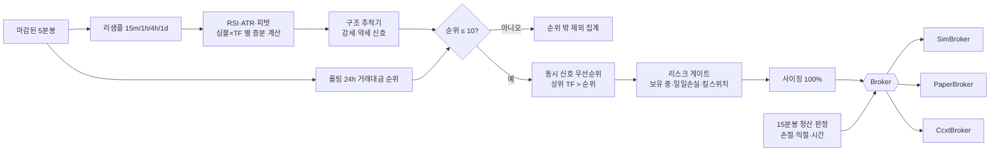

# 바이낸스 USDⓈ-M 상위 10개 코인 RSI 다이버전스 — 설계안 (1단계)

> 상태: 1~4단계 완료 ([2단계](STAGE2_DATA_REPORT.md) · [3단계](STAGE3_SIGNALS_REPORT.md) · [4단계](STAGE4_BACKTEST_REPORT.md) 보고서).
> 5단계는 승인 후 진행.
> 기존 프로젝트(저장소 루트의 `rsidiv`, KOSPI200·현물)와는 별도의 새 프로젝트다(사용자 결정: 처음부터 새로 작성).

---

## 0. 결정 요약

| 항목 | 결정 | 근거·출처 |
|---|---|---|
| 프로젝트 | `futures_divergence/` 폴더, 패키지 `perpdiv`. 기존 코드는 가져다 쓰지 않음 | 사용자 결정 |
| t1(p1) 후보 | 조건을 만족하는 피벗을 **모두 독립 추적**. 한 봉에서 여러 구조가 동시에 성립하면 신호 1건, 가장 최근 t1(p1) 기록 | 사용자 결정 |
| 청산 단위 | ATR·시간 청산 60봉 = **신호 타임프레임** 기준. 손절·익절 도달 판정만 15분봉 | 사용자 결정 |
| 순위 | **코인 단위**: 같은 코인의 USDT·USDC·USD1 무기한 거래대금 합산. 주문은 USDT 무기한 | 사용자 결정 |
| 제외 | 스테이블 기반 페어, **TradFi(주식·ETF·금속·원자재) 무기한** | 사용자 결정 |
| 백테스트 엔진 | **이벤트 기반 자체 구현** | §7 |
| 데이터 원천 | 과거: data.binance.vision 아카이브(SHA-256 검증). 실시간·실거래: ccxt | 이 환경에서 fapi 는 지역 차단(451) |
| 수집 봉 | 5분봉 → 15m/1h/4h/1d 리샘플. 정밀 모드만 1분봉 | 요구사항 |
| 순위 계산 | 2단계: 전 종목 1시간봉으로 롤링 24시간 순위 → 후보 코인만 5분봉으로 정확한 순위 | §9.3 |
| 시간 | 저장·계산 UTC, 표시 KST. 봉 시각 = 봉 시작 시각 | 요구사항 |

---

## 1. 디렉터리 구조

```
futures_divergence/
  config/        base · universe · data · strategy · costs · risk · backtest · optimize · live (.yaml)
  docs/          설계·단계별 보고서
  src/perpdiv/
    core/        설정 스키마·로더, 시간 규칙, .env 비밀정보, 도메인 모델
    data/        공급자(ccxt, 아카이브), 5분봉 캐시, 리샘플, 품질 규칙, 펀딩비, 심볼 목록·순위
    indicators/  Wilder RSI·ATR (일괄·증분), 피벗(확정 시점 포함)
    signals/     강세·약세 구조 추적기 (t1→p2→t3 / p1→t2→p3)
    backtest/    이벤트 루프, 체결 시뮬레이터, 비용·펀딩·청산가, 성과 지표
    optimize/    Optuna/그리드, Walk-forward, 안정성 히트맵, 몬테카를로
    risk/        사이징, 일일 손실, 킬 스위치, API 오류 차단
    broker/      Broker 인터페이스, SimBroker, PaperBroker, CcxtBroker
    live/        스케줄러, SQLite 상태 복구, 주문 관리, 텔레그램, JSON 로그
    reports/     표, 차트, CSV
  tests/
  storage/       (gitignore) cache · state · logs · reports
```

---

## 2. 실행 경로 (백테스트·모의·실거래 공용)



---

## 3. 미래참조 방지 타이밍 규칙

| 규칙 | 구현 | 검증 테스트 |
|---|---|---|
| 피벗 i 는 i+R 봉 **종가 확정 후**에만 존재한다 | indicators.pivots | i+R−1 까지의 데이터로는 안 보임, prefix 불변성 |
| t3(p3)는 그 봉 종가로 판정하고, 그 종가 시각이 신호 시각 | signals | 신호 시각 = t3 봉 시작 + TF |
| 신호 판정에 쓰는 t1·p2(p1·t2)는 그 시각까지 확정된 피벗만 | signals | prefix 불변성, 미래 봉 변경 불변성 |
| 진입 = 신호 다음 봉 시가 (= 신호 시각에 시작하는 15분 실행 봉 시가) | backtest | 진입 시각 = 신호 시각 |
| 순위 = 신호 시각 직전 24시간의 **마감된** 5분봉 거래대금 | data.universe | 창 끝 = 신호 시각, 진행 중인 봉 제외 |
| 리샘플은 마감된 버킷만 (진행 중인 상위 봉 제외) | data.resample | 경계 테스트 |
| 수량 계산 기준가 = 신호 봉 종가 | risk.sizing | 사이징 테스트 |
| 손절·익절은 15분봉 고가·저가로 판정, 같은 봉에서 둘 다 닿으면 손절 | backtest | 체결 테스트 |
| 트레일링 기준 극값은 15분봉 마감 후 갱신, 다음 봉부터 적용 | backtest | 트레일링 테스트 |

---

## 4. 신호 정의 → 코드 (강세 기준, 약세는 대칭)

### 4.1 피벗
- 피벗 저점 i: 왼쪽 `Low[i] < Low[j]` (i−L ≤ j < i), 오른쪽 `Low[i] < Low[j]` 또는 `≤` (i < j ≤ i+R, 동률 규칙에 따름). 고점은 High 로 대칭.
- **동률 규칙** (`pivot.tie_rule`):
  - `first`(기본, 2단계 후 사용자 결정): 오른쪽은 `≤` 허용 → 같은 저가가 이어지면 **첫 봉**만 피벗.
  - `strict`: 오른쪽도 엄격히 `<`. 이웃에 같은 값이 있으면 피벗이 아니다.
  - 가장자리(왼쪽 L개·오른쪽 R개가 없는 봉)는 피벗이 아니다.
- 확정 시점 `confirm = i + R`. 증분 판별기는 i+R 번째 봉을 받는 순간 피벗 i 를 내보낸다.

### 4.2 봉 마감 시 처리 순서 (심볼×TF 마다, 봉 n 마감 직후)

1. RSI(n)·ATR(n) 갱신.
2. 이번에 확정된 피벗(인덱스 n−R) 반영.
   - **새 피벗 저점 j** 이고 `RSI(j) < oversold` 이면 구조 `S(t1=j)` 생성. RSI 가 워밍업 중(NaN)이면 만들지 않는다.
   - **새 피벗 고점 k** 이면, `t1 < k` 인 모든 구조에서 `p2` 가 없거나 `High(k) > High(p2)` 이면 `p2 ← k`
     (요구사항: "p2보다 높은 새 피벗 고점이 확정되면 기존 구조 폐기, 새 구조로 탐색" = 조합 (t1, k) 로 교체).
3. 만료: `n − t1 > max_gap` 인 구조는 삭제 (간격 필터가 켜진 경우).
4. 각 구조에서 t3 판정 (`p2` 가 있고 `p2 < n` 인 것):
   - 이탈 확정: `Close(n) < min(Low[p2 .. n−1])`
   - p2 유효성: `High(p2) = max(High[t1 .. n−1])` — 피벗이 아닌 봉(동률 등)이 p2 보다 높으면 이 (t1, p2) 는
     신호를 낼 수 없다. 더 높은 피벗 고점이 확정되면 2단계에서 새 조합으로 바뀐다.
   - 가격: `Close(n) < Low(t1)`
   - RSI: `RSI(n) > oversold` (RSI(t1) < oversold 는 생성 시 확인)
   - 간격: `n − t1 ≤ max`(켜진 경우), `n − t1 ≥ min`(켜진 경우)
   - 이미 신호를 낸 (t1, p2) 조합이면 건너뜀 (조합당 1회)
   - 이탈 봉이 가격·RSI 조건을 못 채우면 다음 봉에서 다시 판정한다. 다음 봉의 이탈 기준 `min(Low[p2..n])` 에는
     실패한 봉의 저가가 포함되므로, 새 저가를 종가로 다시 깨야 한다.
5. 이번 봉에서 성립한 구조가 여럿이면 신호 **1건**(가장 최근 t1 기록), 성립한 조합은 모두 "발신 완료" 표시.

순서 2가 4보다 먼저인 이유: "p2 의 피벗 확정은 늦어도 t3 봉 마감 시점까지" — 같은 봉에서 확정된 피벗도 판정에 쓴다.
같은 봉에서 확정된 더 높은 피벗 고점 k(= n−R)가 있으면 옛 조합은 이미 유효하지 않다(k 가 [t1, n−1] 의 최고가).
따라서 교체 후 판정해도 결과가 같고, 새 조합 (t1, k) 은 `n > k` 이므로 같은 봉에서 바로 판정된다.

구조 폐기 규칙 `structure.discard_on_anchor_break` (기본 true, 3단계 후 사용자 결정): 2단계에서 p2 를 지정·교체할 때
`min Low[t1..p2] < Low(t1)` 이면 구조를 버린다 (약세: `max High[p1..t2] > High(p1)`). p2 는 뒤로만 바뀌므로 한 번 깨진 구조는
되살아나지 않는다. p2 뒤(p2~t3)의 더 낮은 저가는 이탈 구간이라 폐기 사유가 아니다.

### 4.3 약세 (대칭)
- `RSI(p1) > overbought` 인 피벗 고점 p1 → 구조 생성. 더 낮은 피벗 저점이 확정되면 `t2` 교체.
- 이탈: `Close(n) > max(High[t2 .. n−1])`, 유효성 `Low(t2) = min(Low[p1 .. n−1])`,
  가격 `Close(n) > High(p1)`, RSI `RSI(n) < overbought`.

### 4.4 신호 레코드
심볼, TF, 방향, t1/p2/t3 (p1/t2/p3) 인덱스·시각·가격, RSI(t1)·RSI(t3), ATR(t3), 신호 시각, 동시 성립 구조 수.

---

## 5. 포지션 운용

- 동시 보유 1개. 보유 중 신호 → `보유 중 스킵` 집계.
- 같은 시각에 확정된 신호 여러 개: 상위 TF 먼저, 같은 TF 면 순위(거래대금) 상위 먼저. 첫 신호만 진입, 나머지는 `동시 신호 후순위` 집계.
  (1d 봉 마감 00:00 UTC 에는 1d·4h·1h·15m 봉이 모두 마감되므로 이 규칙이 자주 쓰인다.)
- 순위 밖 신호(신호 시각 순위 > 10)는 `순위 밖 제외` 집계. 신호 판정 자체는 후보군 전체에서 한다(구조 상태 연속성).
- 반대 방향 신호: `ignore`(기본) 또는 `switch`(현재 포지션을 다음 봉 시가에 청산하고 반대 진입).
- 사이징: 명목가 = 평가금액 × 100% × 레버리지 × (1 − fee_buffer). 수량 = 명목가 ÷ 신호 봉 종가, 수량 단위로 내림.
  `fee_buffer`(0.2%)는 진입 증거금 + 수수료가 잔고를 넘어 주문이 거부되는 것을 막기 위한 **가정**이다.

## 6. 청산

| 항목 | 규칙 |
|---|---|
| 판정 봉 | 15분봉 (정밀 모드: 1분봉으로 봉 내부 순서) |
| ATR | 신호 TF 의 Wilder ATR(14), t3(p3) 봉 값 |
| 손절 | Long `Low(t3) − ATR×2.5`, Short `High(p3) + ATR×2.5`, 스탑마켓(테이커) |
| 익절 `r_multiple`(기본) | 진입가 ± 손절폭 × 2 (손절폭 = 진입 체결가 − 손절가) |
| 익절 `structure` | Long `High(p2)`, Short `Low(t2)` |
| 익절 `trailing` | 진입 후 15분봉 최고가(숏 최저가) ∓ ATR(t3) × `trailing_atr_mult`. 15분봉 마감마다 갱신, 손절가보다 불리하게는 안 움직임 |
| 시간 청산 | 진입 후 신호 TF 60봉 안에 목표 미도달 → 60봉째 마감 후 다음 15분봉 시가 시장가 |
| 같은 봉 손절·익절 | 손절 우선 |
| 갭 | 시가가 손절가보다 불리하면 시가 체결 |
| 청산가 | 레버리지 > 1 이면 격리 마진 청산가를 15분봉 저가(숏 고가)로 판정, 손절보다 먼저 닿으면 청산 처리 |
| 상장폐지·거래 중단 | 마지막 체결가로 청산 기록 |

## 7. 백테스트 엔진: 이벤트 기반 자체 구현

| 요구사항 | vectorbt | backtrader | 자체 구현 |
|---|---|---|---|
| 심볼 × 4 TF 신호를 한 계좌에서 **동시 보유 1개**, 우선순위(TF > 순위) 배정 | 현금 공유·단일 포지션·우선순위를 numba 콜백으로 직접 짜야 함 | 다중 데이터 피드·TF 동기화가 복잡 | 신호 이벤트를 시각·우선순위로 정렬해 처리 |
| (t1, p2) 구조 추적 (경로 의존 상태) | 벡터화 어려움 | 가능 | 증분 추적기를 실거래와 공유 |
| 시점별 거래대금 순위 | 불가에 가까움 | 커스텀 | 가능 |
| 펀딩비 정산(보유 판정·방향별 부호) | 불가 | 커스텀 | 가능 |
| 격리 마진 청산가, 1분봉 정밀 모드 | 어려움 | 부분적 | 가능 |
| 실거래와 같은 코드 경로 | 불가 | 부분적 | **가능** (Broker 만 교체) |

비용은 속도다. 대응:
- 지표·피벗·신호는 심볼×TF 마다 한 번 계산한다(증분 추적기를 봉 배열에 흘림). 신호는 포지션과 무관하게 결정되므로 재사용된다.
- 포지션이 최대 1개라서, 엔진 루프는 신호 이벤트와 보유 중인 포지션의 15분봉만 처리한다.
- 최적화(5단계)는 파라미터마다 신호를 다시 만들어야 한다. 느리면 신호 생성을 병렬화한다.

### 7.1 엔진 세부 규칙 (4단계 구현, `backtest/engine.py`)

| 항목 | 규칙 |
|---|---|
| 처리 순서 (시각 T) | ① 보유 포지션의 T 이전 실행 봉 처리 ② T 시가 예정 청산(시간 청산·킬 스위치 전량 청산) ③ 신호 판정: 순위 밖 → 동시 후순위 → 보유 중(반대 신호 switch 면 T 시가 청산 후 진입) → 킬 스위치 → 일일 손실 → 진입 |
| T 시가의 갭 손절 | 보유 중으로 본다 (같은 시각 새 신호는 보유 중 스킵). 보수적 |
| 봉 내부 청산 시각 | 그 15분봉 시작 시각으로 기록 (펀딩비 정산 F 가 그 시각이면 반영) |
| 수량 단위 | exchangeInfo 대신 아카이브 kline 거래량 문자열 소수 자릿수 (예: BTC 0.001, SOL 0.01, DOGE 1). 최소 명목가 5 USDT (BTC 100, ETH 20 가정) |
| 평가금액·리스크 판정 | 보유 중 15분봉 마감과 이벤트 시각. 봉 내부 최저 평가는 쓰지 않음 |
| 킬 스위치 keep_stops | 기존 손절·익절·시간 청산은 그대로 두고 신규 진입만 영구 중단 (백테스트에는 수동 해제가 없음) |
| 청산가 | 레버리지 > 1 일 때만. 격리 마진 근사식 `진입가 × (1 − 1/L) / (1 − MMR)` (숏 대칭), 테이커 수수료 |
| 벤치마크 | BTCUSDT 무기한 1배 롱, 첫 15분봉 시가 전액 매수(테이커 수수료·슬리피지), 펀딩비 반영 |

## 8. 비용

`config/costs.yaml` 하나를 백테스트·모의·실거래가 공유한다.
- 수수료: 명목가 × (메이커 0.02% / 테이커 0.05%), BNB 10% 할인 옵션. 시장가·스탑마켓 = 테이커, 호가창 대기 지정가 = 메이커.
- 슬리피지: 테이커 체결 0.02% 불리하게. 시나리오 ×0 / ×1 / ×2.
- 펀딩비: 정산 시각 T 에 `진입 < T ≤ 청산` 이면 `수량 × mark price(T) × rate`. Long 은 양수면 지불, Short 는 양수면 수령.
  mark price 는 아카이브 `markPriceKlines` 로 확보한다(없으면 5분봉 시가로 근사).
- 비용 반영 전(gross) 성과를 나란히 보고한다.

## 9. 데이터 계층

### 9.1 원천
| 데이터 | 과거(백테스트) | 실시간(모의·실거래) |
|---|---|---|
| 5분봉 | 아카이브 월별 zip (지난달까지) + 일별 zip (이번 달) | ccxt `fetch_ohlcv` (진행 중 봉 제외) |
| 1분봉 (정밀 모드) | 아카이브 | – |
| 펀딩비 | 아카이브 `fundingRate` 월별 | ccxt `fetch_funding_rate_history` |
| mark price | 아카이브 `markPriceKlines` | ccxt |
| 심볼 목록 | 아카이브 S3 목록 (상장폐지 포함) | exchangeInfo |
| 거래 규칙(최소 수량·틱) | 설정 대체값 | exchangeInfo |

이 원격 환경에서는 fapi.binance.com 이 지역 차단(HTTP 451)이다. 과거 데이터는 아카이브로 받고, ccxt 경로는 국내 PC 에서 검증한다.

### 9.2 품질 규칙
| 경우 | 처리 |
|---|---|
| 중복 봉 | 값이 같으면 하나만 남김. 값이 다르면 오류 (원천 문제) |
| 결측 봉 | 채우지 않는다. 리샘플 버킷은 있는 봉으로 계산하고 결측 수를 기록한다 |
| 거래 없음 봉 | 체결 수 0 이고 OHLC 가 같은 봉. 12개(1시간) 이상 연속이면 거래 중단 구간 → 신호·순위·신규 진입 제외 |
| 상장폐지 | 아카이브는 폐지 후에도 체결 0 고정가 봉을 계속 게시한다(확인됨). 위 규칙으로 폐지 시점을 판정 |
| `...SETTLED` 심볼 | 정산 때 생기는 별도 시리즈. 2단계 점검: 정산일 하루치뿐(대부분 체결 0)이고 원 시리즈와 활성 구간이 겹치지 않음 → 같은 코인으로 합산해도 영향 없음 |

### 9.3 거래대금 순위
- 코인 = 계약 이름에서 증거금 자산(USDT/USDC/USD1)과 `SETTLED` 접미사를 뗀 기준 자산 (`1000PEPE` 등 접두는 그대로).
- 신호 시각 T 의 코인 거래대금 = 그 코인의 모든 스테이블 증거금 무기한의 `[T−24h, T)` 5분봉 거래대금 합.
- 백테스트 후보군은 두 단계로 정한다:
  1. 전 종목 1시간봉으로 매시 정각 기준 롤링 24시간 순위를 계산한다(가볍다).
  2. 어느 시점에든 순위 ≤ `top_n + 여유` 였던 코인만 후보로 5분봉을 받는다. 신호 시각의 순위는 5분봉으로 정확히 계산한다.
- 여유 폭(`candidates.hourly_rank_margin`)은 표본 월마다 "15분 경계의 5분봉 상위 10 코인이 직전 정시 1시간 순위로
  몇 위였나"의 최대값에서 정한다(2단계 측정, [STAGE2 보고서](STAGE2_DATA_REPORT.md)).
- **TradFi 제외 목록**은 `exclude.tradfi_bases` 에 명시한다(실행 중 판별식을 쓰지 않는다). 목록은 2단계 점검의 판별식
  (주말/평일 일간 변동 비율 < 0.45, 또는 평일 변동의 미국장·아시아장 8시간 비중 ≥ 0.45)으로 만들고 사람이 검토한다.
  판별식이 잡았지만 암호화폐로 확인된 코인은 `reviewed_not_tradfi` 에 둔다.

### 9.4 리샘플
- epoch 기준 버킷(바이낸스와 같음): 15m 은 :00/:15/:30/:45, 4h 는 00/04/…/20 UTC, 1d 는 00:00 UTC(= 09:00 KST).
- 마감되지 않은 버킷은 버린다. 아카이브의 15m·1h·4h·1d 원본 봉과 대조하는 테스트를 둔다.

## 10. 리스크 관리 (실거래 규칙, 백테스트는 적용/미적용 비교)

| 이벤트 | 판정 | 발동 시 | 해제 |
|---|---|---|---|
| 일일 손실 3% | (당일 00:00 KST 평가금액 − 현재 평가금액) / 당일 시작 ≥ 3%, 실현+미실현 | 당일 신규 진입 중단, 손절·익절 유지 | 00:00 KST 자동 |
| 누적 MDD 30% | 운용 시작 후 최고 평가금액 대비 | 신규 진입 차단 + `flatten_all` 또는 `keep_stops` | 발동 ID 를 `release_ack` 에 입력 (자동 재개 금지) |
| API 연속 오류 5회 | 성공 1회면 0 으로 | 거래 중단 → 미체결 주문 조회·기록 → 알림 | 수동 (`api_errors.release_ack`) |

세 이벤트 모두 발생 시각, 계좌 상태, 트리거 값을 JSON 로그와 텔레그램에 남긴다.

## 11. 설정 파일

| 파일 | 내용 |
|---|---|
| `base.yaml` | 자본 1,000 USDT, 단방향·격리·1배, 경로, 시간대 |
| `universe.yaml` | 상위 10, 순위 기준(24h 거래대금, 코인 단위 합산), 제외(스테이블·TradFi), 후보군 |
| `data.yaml` | 수집 5m, 신호 TF, 실행 15m, 정밀 1m, 기간, 워밍업, 원천, 품질, 캐시 |
| `strategy.yaml` | RSI·ATR, 피벗 L/R/동률, 강세·약세 기준값, 구조 규칙, 청산, 포지션 규칙 |
| `costs.yaml` | 수수료·BNB·주문유형별 유동성·펀딩·슬리피지·시나리오 |
| `risk.yaml` | 사이징 100%, 동시 1개, 청산가, 일일 손실, 킬 스위치, API 오류 |
| `backtest.yaml` | 체결 규칙, 정밀 모드, 리스크 규칙 비교, 벤치마크, 산출물 |
| `optimize.yaml` | 탐색 공간, WF 12M/6M, 안정성, 몬테카를로 1000회 |
| `live.yaml` | paper/live, 스케줄러 지연, 주문 처리, 상태 복구, 텔레그램, 로그 |

검증(로드 시 오류): 미정의 키, 따옴표 없는 시각, TF 배수 관계, 실행 봉 ≤ 최소 신호 봉, 순위 봉 = 수집 봉,
oversold < overbought, 레버리지 > 1 이면 청산가 반영 필수, `auto_resume: true`, `live_confirm` 없는 `mode: live`,
탐색 공간 키가 strategy.yaml 에 없음.

## 12. 가정·확인 필요 사항

1. **피벗 동률 규칙**: `first` (사용자 결정). 2단계 측정: `strict` 는 `first` 대비 피벗이 15m 0.9~3.6%, 1h 0.3~1.5%,
   4h 0.6% 이하, 1d 0.2% 이하 적다 (BTC·ETH·SOL·DOGE·1000PEPE, 2024-01~2026-09).
2. **p2 유효성**: 피벗이 아닌 봉이 p2 보다 높으면(동률 등) 그 (t1, p2) 는 신호를 낼 수 없다고 해석했다. [t1, t3−1] 에 t1 봉 자체의 High 도 포함한다(문구 그대로).
3. **사이징 fee_buffer 0.2%** (100% 진입 시 증거금 부족 방지).
4. **트레일링 스탑** 정의(§6)와 `structure` 익절에서 진입가가 이미 목표를 넘은 경우(즉시 청산) 처리.
5. **TradFi 판별**: 거래소 메타데이터(exchangeInfo)를 이 환경에서 받을 수 없어 판별식(§9.3) + 검토로 181개를 정했다.
   실거래 전 exchangeInfo `underlyingType`·`underlyingSubType` 으로 재확인한다.
6. **스테이블코인 = 1 USD** 로 보고 USDC·USD1 계약 거래대금을 합산한다.
7. **BTC Buy & Hold**: BTCUSDT 무기한 1배 롱(진입 수수료·펀딩비 반영).
8. 백테스트 시작 시점의 지표 워밍업은 `warmup_days`(200일) 선행 데이터로 한다. 워밍업 구간 신호는 집계하지 않는다.
   시작점이 다른 두 RSI(14) 의 차이는 첫 유효값 뒤 약 120봉에 0.01, 250봉에 1e−6 아래(실측 최악) → 1d 도 200봉 확보.
9. **거래 중단 봉**(체결 0·고정가 12개 이상 연속, 상장폐지 뒤 포함)은 리샘플 전에 빼서 결측으로 취급한다.
10. **백테스트 끝 = 지난달 말** (`backtest_period.end: last_month_end`, 사용자 결정): 아카이브 펀딩비는 월 파일만 있어
    진행 중인 달을 뺀다.
11. **구조 폐기** (3단계 후 사용자 결정): t1~p2 사이에 Low(t1) 보다 낮은 저가(약세: p1~t2 사이 더 높은 고가)가 나오면 구조를
    버린다 (`structure.discard_on_anchor_break: true`). p2 봉 자신의 저가도 포함한다.

## 13. 단계별 산출물

| 단계 | 산출물 | 승인 기준 |
|---|---|---|
| 1 | 구조, 설정 파일·스키마·테스트, 이 문서 | 해석·기본값 확인 |
| 2 | 데이터 점검 보고, 데이터 계층, RSI·ATR·피벗, 테스트 | 확보 기간·후보군 확정, RSI 외부 라이브러리 일치, 피벗 미래참조 테스트 |
| 3 | 구조 추적기(강세·약세), BTC/USDT 최근 12개월 4개 TF 신호 차트 | 육안 검증 |
| 4 | 엔진, 비용, 리포트, 거래 CSV | 비용 전/후, 방향·TF·심볼별, 리스크 규칙 on/off |
| 5 | 최적화, WF, 히트맵, 몬테카를로 | IS/OOS 분리, 부적합 근거 |
| 6 | PaperBroker | 4주 이상 운영, 괴리 분석 |
| 7 | CcxtBroker, 스케줄러, 상태 복구, 리스크, 텔레그램 | 발동·리셋 테스트 |
